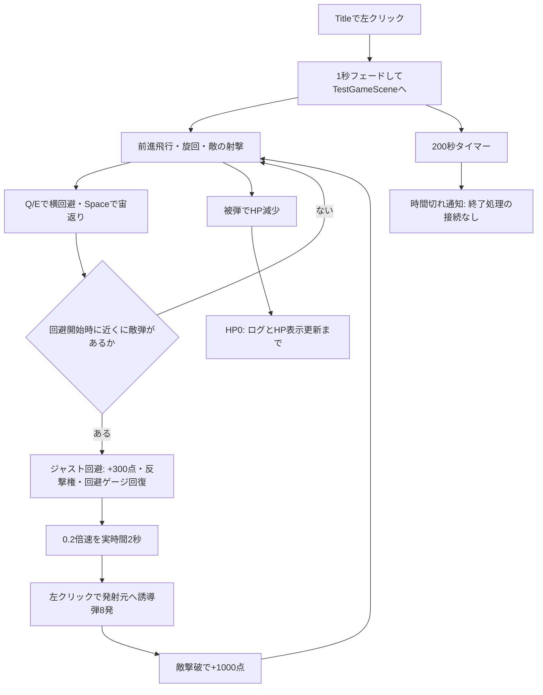

# TopGun：仕様・初期設計と現在の実装状況

> 更新：2026-09-29に死亡・時間切れからのリザルト遷移、タイトル復帰、敵HP初期化を実装・Playモード確認済み。回避中の反撃はユーザー確認済みの現行仕様。以下は改修前の調査記録として残す。最新の変更点は[リザルト実装記録](C:/TopGun/Docs/Result実装確認_2026-09-29.md)を参照。

調査日：2026-09-28（日本時間）  
対象：`C:/TopGun`、調査時のHEAD `033fda8`  
根拠：今回提示された仕様・設計、現行C#、Input Actions、Unity Editor経由で取得したシーン・Prefab設定。

## 1. 現在地

**現在のTopGunは「飛行しながら敵弾をジャスト回避し、スロー中に誘導弾で反撃する」遊びを作り込んだ試作段階。初期設計のフェーズ進行・障害物ルール・ゲーム終了・ランキングはまだ成立していない。**

飛行、回避、敵の攻撃、反撃、フレア、ゲージ、音・カメラ演出には具体的な実装とシーン接続がある。一方、「開始から終了・結果までの1プレイ」をまとめる制御が不足している。

今回の「実装・接続あり」は、コードと保存済みシーン設定で確認した意味。今回新しくPlayモードで操作・完走したわけではなく、操作感や実行時の全経路まで保証するものではない。

### 調査時のEditor状態

| 項目 | 確認結果 |
| --- | --- |
| Unity | 6000.3.2f1、接続ready、Play停止中 |
| 開いていたシーン | Title。未保存変更あり |
| ゲームシーンの調査方法 | 保存済みTestGameSceneを一時Preview Sceneで読み取り、終了後に閉じた |
| Build Settings | Title → TestGameSceneの2シーンが有効 |
| コンパイル | compilationFailed=false、Console Errors=0 |
| 警告 | Console Warnings=3。取得した直近の警告はRender Textureの深度バッファ不足 |
| Missing Script | 調査したTitleとTestGameSceneのGameObject上では0件 |
| 自作コードの規模 | Assets/Scripts以下に59本のC#。入力生成コード・Editor拡張・外部ライブラリは別 |

Titleの未保存変更は保持し、ゲームコード・シーン・Prefabの修正は行っていない。コンパイル状態の確認であり、ビルドや自動テストの合格判定ではない。

## 2. 初期仕様を整理すると

### ゲームとして目指していたもの

- 数分間の3Dフライト回避アクション、スコアアタック。
- スピード調整は補助。ロール・機首操作・慣性による回避が主役。
- 戦闘フェーズでは敵を倒しながら回避。谷抜けでは攻撃を封じ、地形・障害物回避に集中。
- 三人称を基本とし、機首方向と射撃方向を一致させる。
- HP、被弾・回避・フェーズ突破に基づく評価、ゲームオーバー、ランキング。
- 敵は砲台・前方密着・追尾の3系統。弾は直線・誘導・爆風・高速。
- 着陸、完全一人称、ローグライト強化は将来範囲。

### 初期設計の責任分担

| 層 | 役割 | 想定部品 |
| --- | --- | --- |
| Game | 今のルール、フェーズ、終了・結果 | GameManager、GameStateMachine、Combat/Valley/Chase/ResultのState |
| World | 敵や障害物の配置・生成・回収 | EnemyManager、EnemySpawner、ObstacleManager、EnvironmentManager |
| Player | 入力、飛行、回避、武器、HP、カメラ | PlayerAircraft、Mover、Weapon、Health、AircraftStateMachine |
| Combat | 弾、ダメージルール、再利用 | BulletBase、DamageInfo/DamageType、Factory、ObjectPool |

狙いは「Stateが行動の可否を決め、Managerが実行を指示し、個体は自分の動作を担当する」こと。プレイヤーが全体進行やスコアを直接判断しない方針だった。

### 元の資料自体に残る未確定点

1. **カメラ**：「進行方向固定」「マウスで視点操作」「機首方向=カメラforward」が併記されている。レール方向固定なのか、機体追従なのか、カメラが機首を導くのかは一本化されていない。
2. **障害物ダメージ**：「DamageSystemを共有しない」と「DamageType.Obstacleで統一処理」が併記されている。敵とは別の障害物判定を持ち、HP適用だけ共通化する解釈なら両立できるが、正式決定ではない。
3. **障害物への衝突結果**：「即死」と「即死 or 大ダメージ」の両方がある。
4. **攻撃**：初期の自動ロック・自動射撃を残すか、現在のジャスト回避カウンターを主攻撃にするかは未整理。
5. **フェーズ**：基本仕様はCombat/Valleyの2本、詳細設計にはChaseも追加されている。

これらは実装漏れと区別し、次に仕様を確定する項目として扱う。

## 3. 今のプレイ内容をコードから追う



ジャスト回避は「攻撃を一定時間避け切ったか」ではなく、**回避開始の瞬間に、検知Collider内の敵弾が機体から設定距離以内にあるか**で判定する。最も近い弾の発射元を反撃ターゲットとして記憶する。

敵誘導弾へのジャスト回避ではフレアも発射。フレアは誘導先を引き受け、衝突時に周囲の弾を消す。反撃は画面中央の敵を選ぶ方式ではない。

## 4. 実際の入力と設定値

### 入力

| 操作 | 現在の割り当てと動作 | 初期仕様との差 |
| --- | --- | --- |
| W / S | 加速 / 減速 | 基本一致 |
| A / D | ロール。傾きから旋回量を作る | 上限設定は90度ではなく80度 |
| マウス上下 | ピッチ操作 | 設定上の上限60度 |
| マウス左右 | 入力は取得するがyawSpeed=0 | 現シーンでは直接ヨー操作に効かない |
| Q / E | 左右のバレルロール回避 | 実装済み |
| Space | 宙返り回避 | 初期仕様から追加 |
| 左クリック | ジャスト回避後のスロー中に反撃 | ロック補助・通常自動射撃ではない |
| 右クリック | 前方/後方カメラのトグル | 初期仕様から追加。押している間だけではない |

根拠：[入力定義](C:/TopGun/Assets/InputAction/RideActions.inputactions)、[入力処理](C:/TopGun/Assets/Scripts/Player/PlayerInputHandler.cs)。

### TestGameSceneの主要設定

| 項目 | 現在値 |
| --- | --- |
| 基本・最低・最高速度 | 30 / 30 / 80 Unity単位/秒。加速度設定5 |
| 飛行方式 | RigidbodyのlinearVelocityを毎回forward×速度へ設定。重力なし |
| 姿勢 | Pitch速度5、Yaw速度0、Roll速度40、Pitch上限60度、Roll上限80度 |
| プレイヤー最大HP | 10（Awakeで初期化） |
| 回避 | スプライン移動＋表示モデル1回転、1.2ゲーム秒、回避中は無敵・通常操縦停止 |
| 回避クールダウン | 開始時に1ゲーム秒セット。回避の1.2秒と並行して減る |
| 回避チャージ | 最大3、非回避時に0.5回分/ゲーム秒回復 |
| ジャスト判定距離 | 8 Unity単位 |
| ジャスト報酬 | 300点、反撃トークン+1、回避チャージ+1 |
| スロー | 0.2倍速、実時間2秒 |
| 反撃 | トークン1消費、8発、リング半径30、実時間2秒クールダウン |
| 反撃トークン上限 | 3 |
| フレア | 2個、寿命20ゲーム秒、弾消去範囲半径5 |
| 制限時間 | 200実時間秒（3分20秒）。スロー中も通常速度で減る |

速度はコード上のUnity単位であり、km/h換算は定義されていない。移動方向の慣性・空力モデルはなく、速度の増減と姿勢復元によって操作感を作る方式。

### 弾Prefabの設定

| 弾 | 威力 | 速度 | 寿命 | 特徴 |
| --- | ---: | ---: | ---: | --- |
| EnemyStraightBullet | 1 | 100 | 10秒 | 指定方向に直進 |
| EnemyHomingBullet | 2 | 80 | 30秒 | 初めの1秒は前進、その後誘導。フレアに誘導される |
| PlayerCounterBullet | 3 | 100 | 20秒 | 初めの1秒は前進、その後記憶した発射元へ誘導 |

時間は弾の移動・寿命に使うゲーム時間。ExplosionFxは視覚・カメラ演出で、範囲ダメージ弾の実装ではない。

## 5. 初期仕様との対応表

「未実装」は調査対象の自作コード・シーンで対応処理を確認できなかったもの。「土台のみ」は型やAPIはあるが必要な利用側がないもの。

| 仕様・設計 | 現状 | 判定 |
| --- | --- | --- |
| 三人称飛行 | Cinemachineによる追従、機首前方への移動 | 実装・接続あり |
| ロールに応じた旋回 | PlayerAirCraftController | 実装・接続あり。角度制限に要確認点あり |
| 方向の慣性 | 速度ベクトルをforwardに直接設定 | 初期意図から簡略化 |
| Q/E回避・無敵 | PlayerEvadeController | 実装・接続あり |
| ジャスト回避・スロー・反撃・フレア | 専用コンポーネント一式 | 初期資料にない発展要素 |
| 通常前方射撃・中央ロック・自動攻撃 | 通常武器やターゲット選択処理なし | 未実装 |
| 機首上げ過ぎで射撃不可 | 反撃条件にピッチ制限なし | 未実装 |
| 回避中は射撃不可 | 反撃側は回避状態を確認しない | 初期設計と不一致 |
| Combat / Valley / Chase | 全体Stateと切替処理なし | 未実装 |
| 谷抜け中の攻撃禁止 | 谷フェーズ・射撃権限管理なし | 未実装 |
| 固定砲台 | 単発・連射・誘導砲台 | 実装・接続あり |
| 追尾機 | 回り込み、距離調整、射撃、障害物回避 | 実装・接続あり |
| 前方密着型 | 専用敵なし | 未実装 |
| 敵生成管理 | EnemySpawerに砲台生成APIあり、呼出し元・シーン配置なし | 土台のみ |
| 直線弾・誘導弾 | 基底クラス＋派生弾 | 実装・接続あり |
| 爆風弾・独立した高速弾種 | 爆発エフェクトはあるが攻撃種別としてなし | 未実装 |
| 地形・岩・基地 | ステージとObstacleタグは存在 | 配置あり |
| 障害物衝突による無敵貫通ダメージ | IObstacle、DamageType、プレイヤー衝突ダメージ処理なし | 未実装 |
| HPと表示 | PlayerHealth、ゲージBinder | 実装・接続あり |
| 死亡・ゲームオーバー | HP0にしてログ出力まで | 未完成 |
| 時間切れ・リザルト | タイマー通知だけ。受信処理なし | 未完成 |
| スコア | ジャスト回避+300、敵撃破+1000 | 一部実装 |
| 被弾数評価・フェーズ突破点 | 対応処理なし | 未実装 |
| ランキング・記録保存 | 保存/取得コード、結果シーンなし | 未実装 |
| 一人称 | 前後カメラ切替はあるが一人称切替ではない | 将来範囲 |
| Pool | 弾・爆発は利用。敵は死亡時Destroy、フレアもInstantiate/Destroy | 部分実装 |

## 6. 現在のコード構造と読む順番

実際のフォルダは初期案のGame/World/Player/Combatそのものではなく、機能別になっている。

```text
Assets/Scripts/
  Player/            入力・機体・回避・HP・反撃・カメラ切替
    Counter/         ジャスト判定・反撃権・ターゲット記憶・時間操作
    Flare/           誘導弾のデコイ・弾消去
    State/           StateMachineの器（未接続）
  Enemy/             砲台3種・追尾機・射撃・砲台Spawner
  Bullet/            弾の共通基底・直進・誘導・反撃・弾カメラ
  System/            Pool・ProjectileService・Locator・イベント・スコア・時間
  UI/                HP/回避ゲージ・スコア・タイマー・ポップアップ
  Effects/           爆発・カメラ揺れ・FOV・ジャスト回避時ぼかし
  Audio/             BGM/SE・AudioSourceの再利用
  Title/             タイトル入力・フェード・シーン移動
  Interface/         ダメージ・弾消去・デコイ等の共通契約
  Attributes/        Inspector表示補助
```

| ファイル | 現在の責務・読むポイント |
| --- | --- |
| [PlayerInputHandler](C:/TopGun/Assets/Scripts/Player/PlayerInputHandler.cs) | Input Systemの値とイベントを保持。回避入力を押したフレームで消費 |
| [PlayerAirCraftController](C:/TopGun/Assets/Scripts/Player/PlayerAirCraftController.cs) | 前進速度、ピッチ・ロール・バンク旋回、姿勢復元 |
| [PlayerEvadeController](C:/TopGun/Assets/Scripts/Player/PlayerEvadeController.cs) | スプライン回避、無敵、ゲージ、ジャスト成功、スロー・反撃権・得点をまとめて指示 |
| [JustEvadeDetector](C:/TopGun/Assets/Scripts/Player/Counter/JustEvadeDetector.cs) | Trigger内の敵弾を保持し、最も近い弾を返す |
| [PlayerCounterGunner](C:/TopGun/Assets/Scripts/Player/PlayerCounterGunner.cs) | スロー中の入力・コスト・記憶ターゲットを確認して8発発射 |
| [PlayerHealth](C:/TopGun/Assets/Scripts/Player/PlayerHealth.cs) | HP、単一boolの無敵、HP変化通知。死亡進行は未担当 |
| [EnemyBase](C:/TopGun/Assets/Scripts/Enemy/EnemyBase.cs) | 敵HPと死亡。死亡時に爆発・得点・Destroyまで直接実行 |
| [TurretEnemyBase](C:/TopGun/Assets/Scripts/Enemy/TurretEnemyBase.cs) | 射程・視野・遮蔽・間隔を判定。派生クラスが発射方法を担当 |
| [ChaserEnemy](C:/TopGun/Assets/Scripts/Enemy/ChaserEnemy.cs) | プレイヤー周囲の狙い点・速度・旋回・障害物回避・射撃 |
| [EnemyShooter](C:/TopGun/Assets/Scripts/Enemy/EnemyShooter.cs) | 直線/誘導/確率選択。ProjectileServiceへ生成依頼 |
| [BulletBase](C:/TopGun/Assets/Scripts/Bullet/BulletBase.cs) | 発射元・寿命・ダメージ量・Poolへの返却コールバック |
| [HomingBulletBase](C:/TopGun/Assets/Scripts/Bullet/HomingBulletBase.cs) | 初期前進・追尾・デコイ優先の共通処理 |
| [ProjectileService](C:/TopGun/Assets/Scripts/System/ProjectileService.cs) | 敵の直線/誘導弾と大小爆発のPoolを保持 |
| [ObjectPool](C:/TopGun/Assets/Scripts/System/ObjectPool.cs) | Queueによる汎用再利用。貸出時Active、返却時Inactive |
| [GameEvents](C:/TopGun/Assets/Scripts/System/GameEvents.cs) | 被弾・回避・ジャスト回避・爆発・得点のイベント |
| [PlayerLocator](C:/TopGun/Assets/Scripts/System/PlayerLocator.cs) | プレイヤーTransform/Healthの簡易Service Locator |
| [ScoreManager](C:/TopGun/Assets/Scripts/System/ScoreManager.cs) | 加点と通知。DontDestroyOnLoadで残るがランキング保存はしない |
| [StageCountDownTimer](C:/TopGun/Assets/Scripts/System/StageCountDownTimer.cs) | 200秒を計測してOnTimeUpを発火 |
| [PlayerStateMachine](C:/TopGun/Assets/Scripts/Player/State/PlayerStateMachine.cs) | 切替とUpdate転送のみ。具体State・利用元・シーン配置なし |

### 初期設計との差

- **GameManagerというGameObjectはあるが、GameManagerクラスはない。** そのGameObjectにはTimeDilationController、CounterTargetMemory、StageCountDownTimerが付いている。
- Stateパターンは未運用。現在の可否制御は`_isEvading`、`DisableControl`、`_isInvincible`、`IsPlaying`などのフラグに分散している。
- 入力分離はできているが、Commandオブジェクトによる実装ではなく、値・イベント・消費メソッド方式。
- Damage StrategyやDamageInfoはなく、`IDamageable.TakeDamage(int)`と各クラスの分岐で処理する。
- Poolは共通クラスがあるが、一元的なPoolManagerはない。ProjectileService・反撃武器・EnemySpawerがそれぞれ所有する。
- PlayerEvadeControllerがScoreManager/AudioManagerを直接呼び、EnemyBaseも得点を直接加算する。「プレイヤーは全体を知らない」「敵はスコアを知らない」という初期原則からは外れている。
- HP/回避ゲージのBinder、GameEvents、弾の基底クラスなど、機能分割・通知・共通化は既に活用されている。

## 7. 保存済みゲームシーンの接続状態

| 要素 | 確認した内容 |
| --- | --- |
| PlayerAircraft | 飛行・入力・HP・回避・反撃・CounterToken・FlareEmitter・CameraSwicher・EvationGaugeが有効 |
| ジャスト判定 | 子オブジェクトJustJudgeColiderにJustEvadeDetector |
| 回避軌道 | FlipSplineとSideSplineへの参照あり |
| 敵 | 単発砲台1、誘導砲台2、連射砲台1、追尾機1。いずれも配置・有効化されている |
| 敵の生成 | 現在はシーン直置き。EnemySpawerはシーンにない |
| 通常カメラ | ForwardCamera、BackCamera。追従点LookToTarget、位置と注視に減衰あり |
| 反撃カメラ | BulletCamera/BulletCameraBrain、RenderTexture経由のBCRoot表示 |
| UI | HP、回避ゲージ、使用回数、スコア、得点ポップアップ、残り時間が接続済み |
| 演出 | カメラ揺れ・回避FOV・ジャスト時ぼかし・爆発・音のコンポーネントあり |
| 世界 | 基地、Terrain、岩等。Obstacleタグあり。ただし衝突ダメージのルールはない |

前方カメラは追従点を見る方式なので、「camera.forwardをそのまま機首に設定する」という設計例のコードとは異なる。後方表示ではカメラと機首のforwardも一致しない。

## 8. 優先して直すべき箇所

以下は改修ではなく調査結果。確定できるコード上の欠落と、Playモードで再現確認が必要な懸念を分ける。

### A. コードと設定から確認できる問題・不足

**1. シーン直置きの敵HPが初期化されない。**

[EnemyBase.Spawn](C:/TopGun/Assets/Scripts/Enemy/EnemyBase.cs:17)だけが`_currentHp = _maxHp`を行う。現シーンの敵5体はいずれも保存値`_currentHp=0`で、Spawnを呼ぶSpawnerは配置されていない。各敵のAwake/StartにもHP初期化はない。この経路では最大HP設定が効かず、最初の正のダメージで死亡条件を満たす。EnemyBase.Spawnは`OnSpawned()`も呼ばないため、派生側の再利用時リセット処理も到達しない。

**2. HP0・時間切れでゲームを終了できない。**

[PlayerHealth.Die](C:/TopGun/Assets/Scripts/Player/PlayerHealth.cs:50)はHP更新とログのみ。操縦停止、死亡イベント、リザルト遷移がない。[StageCountDownTimer](C:/TopGun/Assets/Scripts/System/StageCountDownTimer.cs:91)のOnTimeUpにも購読側がない。したがってタイマーやHP表示はあっても、1プレイの終了にはつながっていない。

**3. 回避中の攻撃禁止・谷での攻撃禁止が存在しない。**

[PlayerCounterGunner](C:/TopGun/Assets/Scripts/Player/PlayerCounterGunner.cs:31)はスロー中・クールダウン・トークン・ターゲットだけを確認。回避状態・死亡・フェーズ・機首角度を確認しない。ジャスト回避直後は回避と反撃が両立し得るため、初期設計に戻すなら射撃可否を統合する必要がある。

**4. 敵のPool返却が途中で止まっている。**

[EnemyBase.Die](C:/TopGun/Assets/Scripts/Enemy/EnemyBase.cs:33)で`Release()`がコメントアウトされ、`Destroy(gameObject)`する。EnemySpawerはPoolを持つが、敵の再利用サイクルは完成していない。

**5. 弾カメラのRenderTextureに深度がない。**

[BulletRT](C:/TopGun/Assets/Other/BulletRT.renderTexture)はDepth Stencil Format=Noneで、TestGameSceneのBulletCameraBrainの出力先になっている。EditorのRender Graph警告内容と一致する。描画が意図どおりかは別途目視確認が必要。

### B. 再現確認が必要な挙動・再利用リスク

- **通常姿勢復元が入力回転を上書きする可能性。** [Rotation](C:/TopGun/Assets/Scripts/Player/PlayerAirCraftController.cs:54)は1回目のMoveRotation後、ロール無入力時に古い角度を基準に2回目のMoveRotationを呼ぶ。マウスによるピッチが反映されにくい可能性がある。
- **ロール角制限の判定と適用の符号が違う。** `currentRoll + roll`を検査し、適用は`-roll`。設定80度が左右とも実際の上限として機能するか確認が必要。
- **同フレームにSpaceとQ/Eを押すと回避開始が2回走り得る。** Flip開始の後もSide開始を呼び、途中の`_isEvading`再判定がない。チャージ二重消費や保存したKinematic状態の上書きにつながり得る。
- **Pool再利用時にデコイ参照が残り得る。** HomingBulletBase.OnSpawnedは時間をリセットするが`_decoyTarget`を消さない。返却時のTrigger退出が起きない条件では、再発射した弾が古いフレアへ向かう可能性がある。
- **ジャスト判定の弾集合に非Active弾が残り得る。** Trigger退出だけで除去し、判定時にActive状態を確認しない。Pool返却とTrigger通知の組み合わせを検証する必要がある。
- **スロー時間の後始末がない。** TimeDilationControllerにOnDisable/OnDestroyでのtimeScale復元がなく、スロー中のシーン切替を加える際に対応が必要。
- **敵誘導弾は任意のIDamageableに当たる。** 自分の発射元以外のEnemyBaseも候補になる。陣営フィルタがないため、意図しない同士討ちが起きるかはCollider/物理設定と合わせて確認する。

## 9. 次に実装するなら

まず、現在の強みである回避→反撃を残すか、初期の通常射撃も加えるかを決める。その後は次の順が進めやすい。

1. 敵HP初期化、飛行回転、回避の二重開始、RenderTexture設定を修正し、現在の遊びを安定させる。
2. GameManagerと最小限のGameStateを作り、開始・プレイ中・死亡/時間切れ・リザルト・リトライをつなぐ。
3. 通常/回避/被弾/死亡の行動可否を整理し、射撃権限をフェーズ条件と合成する。
4. 障害物の無敵貫通ルールとValleyフェーズを実装する。
5. 敵生成の管理、敵Pool、追加敵・弾を整える。
6. 被弾・突破評価、スコア保存、ランキングをつなぐ。

次の小さな完成目標は「200秒またはHP0で終了し、得点を確認してリトライできる1プレイ」。その土台ができると、谷フェーズやランキングを追加しても進行制御を作り直しにくくなる。
